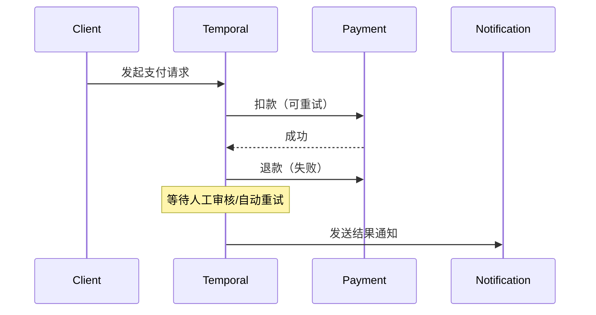

## 概述

**持久化执行（Durable Execution）** 是一种让计算任务能够在中断后从断点恢复的编程范式。2026 年，随着 [[microservices|微服务架构]] 和 Serverless 函数的普及，持久化执行成为保障业务连续性的核心技术。

它与传统 Serverless 的核心区别在于：传统 Serverless 函数是「无状态的、即用即毁的」，而持久化执行则赋予函数「记忆能力」——即使进程崩溃、机器宕机，也能从上一次成功的状态继续执行。

## 核心问题

### 传统 Serverless 的困境

在传统的 FaaS（Function-as-a-Service）模型中，函数执行面临以下挑战：

1. **执行中断**：函数可能因为超时（通常 30 秒到 15 分钟）、内存限制或平台调度而在中途被终止
2. **网络分区**：分布式环境下的网络抖动、临时不可用会导致调用失败
3. **状态丢失**：一旦函数实例被销毁，所有本地状态（内存变量、临时计算结果）全部丢失

```python
# 传统 Serverless 函数的典型问题
def process_order(order_id):
    # 步骤1：查询订单
    order = db.query(order_id)
    
    # 步骤2：调用支付服务（可能超时/失败）
    payment_result = payment_service.charge(order.amount)  # ⚠️ 这里可能失败
    
    # 步骤3：发送确认邮件（永远不会执行）
    send_confirmation(order.customer_email)
    
    return payment_result
```

上述代码中，如果步骤 2 失败，步骤 1 的数据查询结果已经丢失，无法简单重试。

### 网络与超时问题

现代分布式系统中，网络不可靠是常态：

| 问题类型 | 表现 | 影响 |
|---------|------|------|
| 临时网络抖动 | 请求超时 | 任务需要幂等重试 |
| 长时间分区 | 服务完全不可达 | 人工干预成本高 |
| 下游服务限流 | HTTP 429 错误 | 需要背压处理 |

## 解决方案：持久化执行

### 核心原理

持久化执行通过三个关键机制解决上述问题：

1. **状态持久化**：将执行状态写入 durable storage（分布式存储）
2. **检查点（Checkpointing）**：每个步骤完成后记录进度
3. **自动重试**：从最后一个成功检查点恢复执行

```python
# 使用 Temporal 的持久化执行示例
from temporalio import workflow, activity

@activity.defn
async def process_payment(amount: float) -> str:
    """支付活动"""
    return f"payment_{amount}_success"

@workflow.defn
class OrderWorkflow:
    @workflow.run
    async def run(self, order_id: str):
        # 步骤1：查询订单（自动持久化）
        order = await workflow.execute_activity(
            get_order, order_id, start_to_close_timeout=timedelta(seconds=30)
        )
        
        # 步骤2：处理支付（失败后自动重试）
        payment_result = await workflow.execute_activity(
            process_payment, order.amount,
            retry_policy=RetryPolicy(maximum_attempts=3)
        )
        
        # 步骤3：发送确认
        await workflow.execute_activity(
            send_confirmation, order.email
        )
        
        return payment_result
```

### 与 Event-Driven Architecture 的关系

持久化执行是 [[architecture-patterns|事件驱动架构]] 的重要补充。事件驱动强调「fire-and-forget」，而持久化执行则强调「 guaranteed delivery」。两者结合可以构建既灵活又可靠的分布式系统。

## 主流解决方案

### Temporal

[Temporal](https://temporal.io/) 是目前最成熟的持久化执行平台，采用 **Workflow-as-Code** 理念：

- **强一致性**：内置工作流版本控制，支持乐观锁
- **可观测性**：内置 Web UI 查看工作流状态/历史
- **多语言支持**：Go、Java、Python、TypeScript 等
- **自托管选项**：可部署到私有数据中心

```typescript
// Temporal TypeScript SDK
import { Connection, Client } from "@temporalio/client";

const client = await Connection.connect({ address: "localhost:7233" });
const handle = await client.workflow.start(orderWorkflow, {
  taskQueue: "order-processing",
  args: [{ orderId: "ORD-123" }]
});

const result = await handle.result(); // 等待工作流完成
```

### Inngest

[Inngest](https://www.inngest.com/) 专注于**事件驱动的工作流**，主打简单易用：

- 基于事件的触发器，更适合现代云原生应用
- 无需额外部署服务，通过 SDK 接入现有应用
- 支持数万种事件的自动触发

```typescript
// Inngest 事件驱动工作流
import { inngest } from "./client";

export default inngest.createFunction(
  { id: "user-onboarding" },
  { event: "user/signup" },
  async ({ event, step }) => {
    // 步骤1：创建用户记录
    const user = await step.run("create-user", async () => {
      return await db.users.create({ email: event.user.email });
    });

    // 步骤2：发送欢迎邮件
    await step.run("send-welcome-email", async () => {
      await emailService.send(user.id, "welcome");
    });

    // 步骤3：初始化积分
    await step.run("award-signup-credits", async () => {
      await rewardsService.grant(user.id, 100);
    });
  }
);
```

### AWS Step Functions

AWS Step Functions 是亚马逊提供的托管式工作流服务：

- 与 AWS 生态深度集成（Lambda、DynamoDB、SQS 等）
- 支持标准工作流（长期运行）和快速工作流（短时任务）
- 内置错误处理、重试和分支逻辑

```json
{
  "StartAt": "ProcessOrder",
  "States": {
    "ProcessOrder": {
      "Type": "Task",
      "Resource": "arn:aws:lambda:us-east-1:123456789:function:processOrder",
      "Retry": [{
        "ErrorEquals": ["Lambda.ServiceException"],
        "IntervalSeconds": 2,
        "MaxAttempts": 6,
        "BackoffRate": 2
      }],
      "Next": "Payment"
    },
    "Payment": {
      "Type": "Task",
      "Resource": "arn:aws:lambda:us-east-1:123456789:function:processPayment",
      "End": true
    }
  }
}
```

### Cloudflare Workers Durable Objects

[Durable Objects](https://developers.cloudflare.com/durable-objects/) 提供了**单对象持久化状态**的编程模型：

- 每个 Durable Object 实例都有独享的持久化存储
- 适合需要强一致性的协同场景（如在线文档编辑）
- 存储在 Cloudflare 全球网络上，延迟极低

```javascript
// Cloudflare Durable Objects
export class OrderProcessor {
  constructor(state) {
    this.state = state;
  }

  async fetch(request) {
    const order = await request.json();
    
    // 状态自动持久化
    this.state.order = order;
    this.state.processedAt = Date.now();
    
    await this.state.storage.put("order", this.state.order);
    
    return new Response(JSON.stringify({ status: "processed" }));
  }
}
```

## 架构模式

### 工作流定义

工作流（Workflow）是持久化执行的核心抽象，定义业务逻辑的完整流程：

```python
# 工作流定义示例（Temporal Python SDK）
@workflow.defn
class PaymentWorkflow:
    @workflow.run
    async def run(self, payment: PaymentRequest):
        # 信号处理：允许外部中断工作流
        cancel_event = workflow.wait_until(lambda: self.cancelled)
        
        # 执行子任务
        result = await self.process_with_timeout(payment)
        
        # 发送信号通知外部系统
        await workflow.execute_activity(
            notify_payment_complete,
            result,
            start_to_close_timeout=timedelta(seconds=10)
        )
```

### Activity 函数

Activity 是工作流中的具体执行单元，代表与外部系统交互的原子操作：

| 特性 | 说明 |
|------|------|
| 幂等性 | 同一 Activity 可安全重试 |
| 超时控制 | 每个 Activity 可设置独立超时 |
| 重试策略 | 可配置指数退避、有限重试次数 |
| 心跳 | 长时间运行的任务应发送心跳 |

```python
@activity.defn
async def process_payment(amount: float) -> PaymentResult:
    """支付处理 Activity"""
    try:
        result = payment_gateway.charge(amount)
        return PaymentResult(success=True, transaction_id=result.id)
    except PaymentDeclinedError:
        return PaymentResult(success=False, error="declined")
```

### 信号处理（Signals）

信号允许外部系统在运行时向工作流发送消息：

```typescript
// 发送信号修改工作流行为
await client.workflow.signal(handle, "updateShippingAddress", {
  newAddress: "Beijing, China"
});

// 工作流内接收信号
@workflow.defn
class ShippingWorkflow {
  private address = "unknown";

  @workflow.signal
  async updateAddress(self, addr: Address):
    self.address = addr;

  @workflow.run
  async run(self, orderId: string):
    return await self.processOrder(orderId, self.address);
}
```

### 长运行工作流

对于需要数天甚至数月的工作流，持久化执行提供了可靠的保障：

```python
# 长运行工作流示例：订单履行系统
@workflow.defn
class OrderFulfillmentWorkflow:
    @workflow.run
    async def run(self, order_id: str):
        # 阶段1：库存确认（小时级）
        inventory = await self.check_inventory(order_id)
        
        # 阶段2：等待供应商响应（天级）
        supplier_ready = await workflow.wait_until(
            lambda: self.supplier_confirmed,
            timeout=timedelta(days=7)
        )
        
        # 阶段3：物流跟踪（持续数天）
        tracking = await self.track_shipment(order_id)
        
        return OrderResult(status="completed", tracking=tracking)
```

## 应用场景

### 支付处理

支付是持久化执行最典型的应用场景：



### 用户入职工作流

用户注册后的多步骤引导流程：

1. 创建用户账户
2. 发送验证邮件
3. 初始化默认配置
4. 分配欢迎积分
5. 启动新用户引导任务

### 数据处理管道

大规模数据处理通常耗时较长：

```python
@workflow.defn
class DataPipelineWorkflow:
    @workflow.run
    async def run(self, pipeline_id: str):
        # 1. 触发数据抽取
        extraction = await self.extract_data(pipeline_id)
        
        # 2. 数据转换（支持检查点）
        transformed = await self.transform_data(extraction)
        
        # 3. 质量检查
        quality_ok = await self.validate_quality(transformed)
        
        if not quality_ok:
            await workflow.continue_as_new(
                input={"pipeline_id": pipeline_id, "retry_count": self.retry_count + 1}
            )
        
        # 4. 加载到目标系统
        await self.load_data(transformed)
```

### 定时任务与调度

持久化执行配合定时触发器，可以实现可靠的定时任务：

```typescript
// Inngest Cron 触发
export default inngest.createFunction(
  { id: "daily-report", cron: "0 8 * * *" },
  async ({ step }) => {
    const report = await step.run("generate-report", async () => {
      return await analytics.generateDailyReport();
    });

    await step.run("send-email", async () => {
      await email.sendToSubscribers(report);
    });
  }
);
```

## 方案对比

| 特性 | Temporal | Inngest | AWS Step Functions | Durable Objects |
|------|----------|---------|-------------------|------------------|
| **编程模型** | Workflow-as-Code | Event-Driven Functions | JSON 状态机 | 单对象编程 |
| **一致性模型** | 强一致性 | 最终一致性 | 强一致性 | 强一致性 |
| **状态存储** | Durable | Event Sourcing | AWS DynamoDB | KV Store |
| **自托管** | ✅ 支持 | ❌ 仅云服务 | ❌ 仅 AWS | ❌ 仅 Cloudflare |
| **生态集成** | 通用 | 云原生优先 | AWS 全家桶 | Cloudflare 网络 |
| **学习曲线** | 中等 | 较低 | 较低 | 中等 |
| **社区活跃度** | 活跃 | 快速增长 | 成熟稳定 | 活跃 |
| **适合场景** | 复杂业务逻辑 | 现代 Web 应用 | AWS 现有项目 | 实时协作 |

## 最佳实践

### 幂等性设计

每个 Activity 都应该设计成**幂等的**——即同一操作执行多次与执行一次产生相同结果：

```python
@activity.defn
async def process_payment(payment_id: str, amount: float) -> str:
    """幂等的支付处理"""
    existing = await db.payments.find_by_idempotency_key(payment_id)
    if existing:
        return existing  # 已处理过，直接返回
    
    result = payment_gateway.charge(payment_id, amount)
    await db.payments.create({
        "idempotency_key": payment_id,
        "transaction_id": result.id,
        "status": "completed"
    })
    return result.id
```

### 超时配置

合理设置超时是保障系统稳定性的关键：

| 类型 | 建议值 | 说明 |
|------|--------|------|
| Activity 超时 | 业务操作时间的 2-3 倍 | 允许一定波动 |
| 工作流超时 | 业务允许的最大延迟 | 防止僵尸工作流 |
| 重试间隔 | 指数退避，1s → 2s → 4s | 避免惊群效应 |
| 心跳间隔 | 操作时间的 1/10 | 及时发现故障 |

```python
await workflow.execute_activity(
    process_payment,
    payment_data,
    start_to_close_timeout=timedelta(minutes=5),  # 活动超时
    heartbeat_timeout=timedelta(seconds=30),       # 心跳超时
    retry_policy=RetryPolicy(
        initial_interval=timedelta(seconds=1),
        maximum_interval=timedelta(minutes=1),
        maximum_attempts=5,
        non_retryable_error_types=["InvalidPaymentError"]
    )
)
```

### 重试策略

重试策略需要根据业务场景精心设计：

```typescript
// 合理的重试配置
const retryPolicy: RetryPolicy = {
  maximumAttempts: 5,
  backoffCoefficient: 2.0,
  initialInterval: { seconds: 1 },
  maximumInterval: { minutes: 5 },
  nonRetryableErrorTypes: [
    "ValidationError",    // 业务校验错误，不应重试
    "InsufficientFunds"   // 余额不足，重试也无用
  ]
};
```

### 事件溯源兼容性

持久化执行天然适合与[[architecture-patterns|事件溯源]]（Event Sourcing）结合：

- 每个工作流执行步骤都是一条不可变事件
- 完整的历史记录便于审计和调试
- 可以通过重放事件重建任意时刻的状态

```python
# 事件溯源风格的工作流
@workflow.defn
class AccountWorkflow:
    @workflow.run
    async def run(self, account_id: str):
        # 获取历史事件
        events = await workflow.execute_activity(
            get_account_events, account_id
        )
        
        # 重放计算当前状态
        balance = self.replay_events(events)
        
        # 执行操作并记录新事件
        new_event = AccountEvent(
            type="WITHDRAWAL",
            amount=100,
            timestamp=datetime.now()
        )
        
        await workflow.execute_activity(
            append_event, account_id, new_event
        )
```

## 总结

持久化执行正在成为 2026 年后端工程师的必备技能。它解决了 Serverless 时代的核心痛点——状态丢失和执行不可靠，让开发者能够以更声明式的方式构建可靠的分布式系统。

选择建议：

- **复杂业务逻辑**：选择 [[https://temporal.io|Temporal]]，成熟稳定
- **现代云原生应用**：选择 [[https://www.inngest.com|Inngest]]，上手简单
- **AWS 生态项目**：选择 AWS Step Functions，集成最佳
- **实时协作场景**：选择 Durable Objects，低延迟强一致

[^1]

[^1]: 参考资料：[Temporal 官方文档](https://docs.temporal.io/)、[Inngest 官方文档](https://www.inngest.com/docs)、[AWS Step Functions 开发者指南](https://docs.aws.amazon.com/step-functions/latest/dg/)
